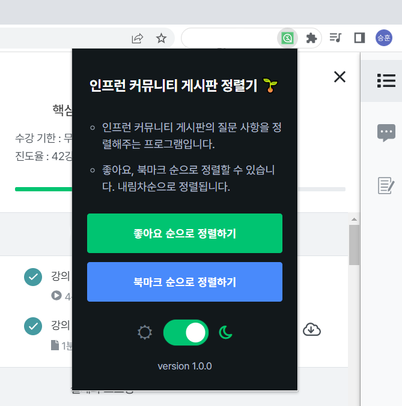

# 인프런 커뮤니티 게시판 정렬기

인프런 사이트에서 수강하고 있는 강의에 대한 질문 글들을 정렬하여 보여주는 크롬 확장 프로그램입니다.

## Why this is needed?

인프런은 수강하고 있는 강의에 대해 수강자들이 질문할 수 있는 게시판이 존재합니다.
당연히 좋아요가 많거나 북마크 수가 많을수록 더 유용한 정보들을 얻을 수 있습니다.

그러나 현재 인프런에서는 아직까지
각 강좌에 대한 커뮤니티 게시판의 정렬 기능을 지원하지 않습니다.
그래서 필자는 조금 더 효율적으로 공부하려면 이 기능이 필요하다고 생각해 만들게 되었습니다.

## Features

현재 지원하고 있는 기능은 아래와 같습니다:

- 좋아요 순으로 정렬 (내림차 순)
- 북마크 순으로 정렬 (내림차 순)
- 다크 모드 지원

## Screenshots

### 기본 화면

### 다크 모드

